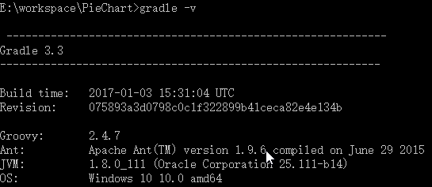
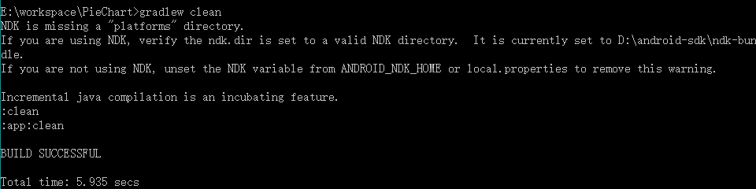
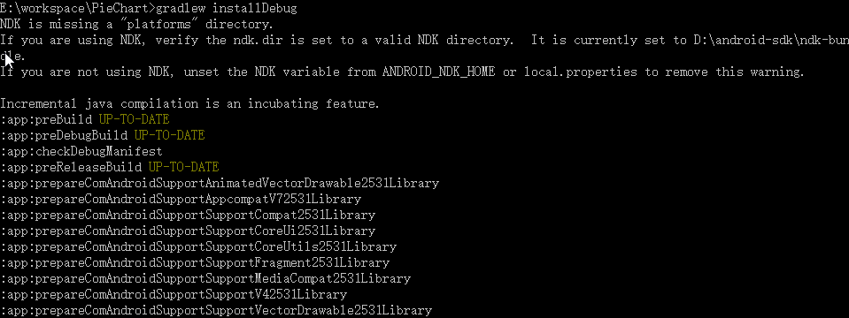

## gradle配置

- 配置GRADLE_HOME-->`C:\Program Files\Android\Android Studio\gradle\gradle-3.3`
- 配置GRADLE_USER_HOME-->`D:\java\gradle\.gradle` ，默认是在`C:\Users\Administrator\.gradle`选择性的修改
- 配置path-->`%GRADLE_HOME%\bin`

## gradle构建

- Gradle构建脚本（build.gradle）指定了一个项目和它的任务。
- Gradle属性文件（gradle.properties）用来配置构建属性。
- Gradle设置文件（gradle.settings）对于只有一个项目的构建而言是可选的，如果我们的构建中包含多于一个项目，那么它就是必须的，因为它描述了`哪一个项目参与构建`。每一个多项目的构建都必须在项目结构的根目录中加入一个设置文件。

## gradle命令

```
gradlew clean
gradlew assembleDebug
gradlew installDebug
gradlew assembleRelease

# 声明项目使用的Gradle版本
gradlew wrapper --gradle-version version-number

gradlew init wrapper

gradlew build
```

- gradlew -v 查看当前项目所用的Gradle版本 
- gradlew clean 清除9GAG/app目录下的build文件夹 
- gradlew build 编译项目并生成相应的apk文件 
- gradlew assembleDebug 编译并打Debug包 
- gradlew assembleRelease 编译并打Release的包 
- gradlew installRelease Release 模式打包并安装 
- gradlew uninstallRelease 卸载Release模式包 







## module gradle

```gradle
apply plugin: 'com.android.application'

android {
    compileSdkVersion 25
    buildToolsVersion "25.0.3"

    defaultConfig {
        applicationId "com.jackchan.processorsample"
        minSdkVersion 14
        targetSdkVersion 25
        versionCode 1
        versionName "1.0"

        testInstrumentationRunner "android.support.test.runner.AndroidJUnitRunner"
        
        jackOptions{
            enabled true
        }

    }
    buildTypes {
        release {
            minifyEnabled false
            proguardFiles getDefaultProguardFile('proguard-android.txt'), 'proguard-rules.pro'
        }
    }

    compileOptions { // 配置jdk版本
        targetCompatibility JavaVersion.VERSION_1_7
        sourceCompatibility = JavaVersion.VERSION_1_7
    }
}

// 错误 编码GBK的不可映射字符
tasks.withType(JavaCompile) {
    options.encoding = "UTF-8"
}

dependencies {
    compile fileTree(include: ['*.jar'], dir: 'libs')
    androidTestCompile('com.android.support.test.espresso:espresso-core:2.2.2', {
        exclude group: 'com.android.support', module: 'support-annotations'
    })
    compile 'com.android.support:appcompat-v7:25.3.1'
}
```