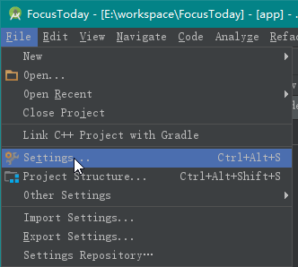
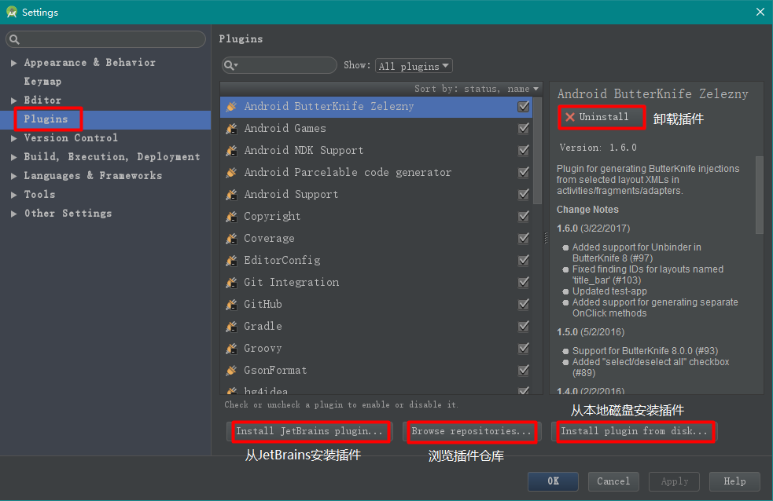
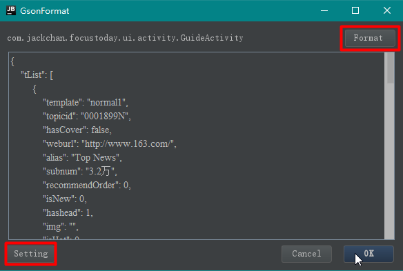
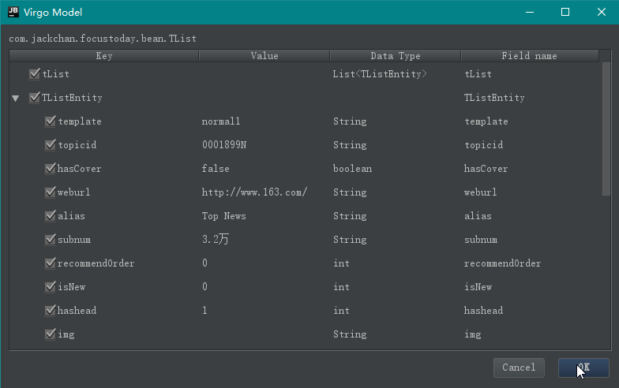

## 插件的安装

File → Settings → Plugins





## 常用插件

下载地址:http://plugins.jetbrains.com/

| 插件                                | 功能描述                      |
| :-------------------------------- | :------------------------ |
| ADB Idea                          | 方便卸载apk,删除缓存              |
| Android ButterKnife Zelezny       | ButterKnife对应的插件          |
| Android Code Generator Plugin     | 生成ViewHolder,生成initView方法 |
| Codota                            | 搜索代码块                     |
| GsonFormat                        | jsonString自动转bean插件       |
| genymotion-idea-plugin            | genymotion对应的插件           |
| SelectorChapek for Android        | 帮助生成selector              |
| Sexy Editor                       | 代码区域加背景                   |
| Android Drawable Importer         | 同一张图片生成多个自动生成多分辨率图片       |
| Android Layout ID Converter       | xml到控件的转换                 |
| Android Postfix Completion        | toast和log加强               |
| Android Studio Prettify           | 帮助findViewById            |
| .ignore                           | git忽略文件高亮效果,文件夹颜色提示       |
| Android Parcelable code generator | 生成Parcelable代码            |
| Gradle Dependencies Helper        | gradle帮助插件                |
| Android Toolbox Plugin            | 生成ViewHolder,意义不大         |

##  GsonFormat

使用快捷键Alt + Insert




把需要格式化的json粘贴进去

```json
{
    "tList": [
        {
            "template": "normal1",
            "topicid": "0001899N",
            "hasCover": false,
            "weburl": "http://www.163.com/",
            "alias": "Top News",
            "subnum": "3.2万",
            "recommendOrder": 0,
            "isNew": 0,
            "hashead": 1,
            "img": "",
            "isHot": 0,
            "hasIcon": false,
            "cid": "C1348646712614",
            "recommend": "0",
            "headLine": true,
            "hasAD": 1,
            "color": "",
            "bannerOrder": 0,
            "tname": "头条",
            "ename": "androidnews",
            "showType": "comment",
            "special": 0,
            "tid": "T1348647909107",
            "ad_type": 1
        },
        {
            "template": "normal1",
            "topicid": "0001899N;000187QQ",
            "hasCover": false,
            "alias": "yaowenspecial",
            "subnum": "10.6万",
            "recommendOrder": 0,
            "isNew": 0,
            "hashead": 1,
            "img": "",
            "isHot": 0,
            "hasIcon": false,
            "cid": "C1348647991705",
            "recommend": "0",
            "headLine": false,
            "hasAD": 1,
            "color": "",
            "bannerOrder": 0,
            "tname": "要闻",
            "ename": "yaowenspecial",
            "showType": "comment",
            "special": 0,
            "tid": "T1467284926140",
            "ad_type": 1
        },
        {
            "template": "recommend",
            "topicid": "00037VVH",
            "hasCover": false,
            "weburl": "http://ent.163.com/",
            "alias": "Entertainment",
            "subnum": "超过1000万",
            "recommendOrder": 120,
            "isNew": 0,
            "hashead": 1,
            "img": "T1348648517839",
            "isHot": 0,
            "hasIcon": true,
            "cid": "C1348648351901",
            "recommend": "1",
            "headLine": false,
            "hasAD": 1,
            "color": "",
            "bannerOrder": 0,
            "tname": "娱乐",
            "ename": "yule",
            "showType": "comment",
            "special": 0,
            "tid": "T1348648517839",
            "ad_type": 1
        }
    ]
}
```

选择需要生成javabean的字段



生成的javabean

```java
public class TList {

    public List<TListEntity> tList;

    public static class TListEntity {
        public String  template;
        public String  topicid;
        public boolean hasCover;
        public String  weburl;
        public String  alias;
        public String  subnum;
        public int     recommendOrder;
        public int     isNew;
        public int     hashead;
        public String  img;
        public int     isHot;
        public boolean hasIcon;
        public String  cid;
        public String  recommend;
        public boolean headLine;
        public int     hasAD;
        public String  color;
        public int     bannerOrder;
        public String  tname;
        public String  ename;
        public String  showType;
        public int     special;
        public String  tid;
        public int     ad_type;
    }
}
```

## Android ButterKnife Zelezny

