## 常用快捷键

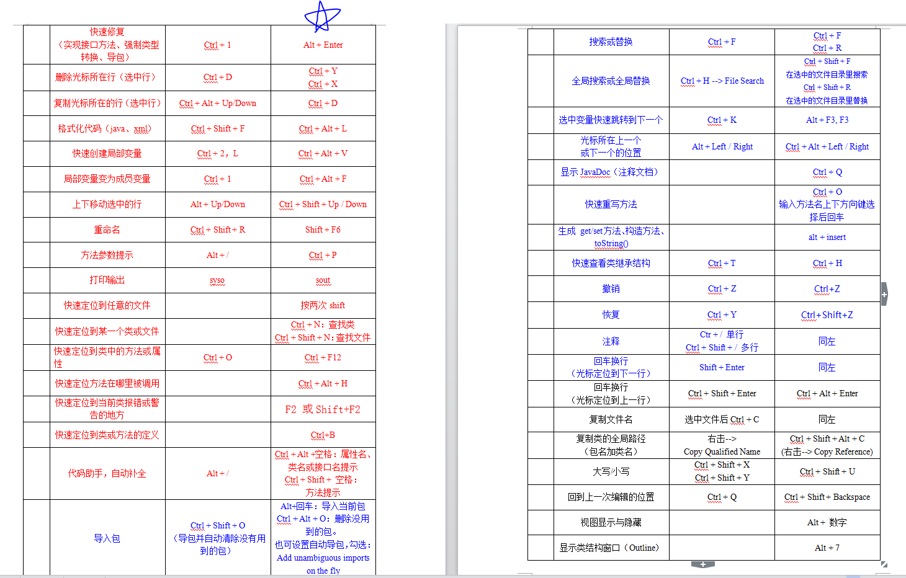

| 快捷键                | 功能说明                                     |
| :----------------- | :--------------------------------------- |
| Alt + shift + R    | Rename，重命名                               |
| Ctrl + shift + o   | 导包                                       |
| Ctrl + shift + F   | 格式化代码                                    |
| Ctrl + shift + /   | 注释一段代码(/**/)                             |
| Ctrl + /           | 注释代码(//)                                 |
| Ctrl + alt + f     | 将变量提升为全局变量                               |
| Ctrl + alt + v     | 快速创建局部变量                                 |
| Alt + insert       | 快速插入：constructor，setter，getter，equals，tostring，hashcode，  Override method… |
| Alt + enter        | 快速修复：强制类型转换，实现接口方法，导包                    |
| Alt + P            | 方法参数提示                                   |
| Ctrl + K           | 选中变量，快速跳到下一个                             |
| Ctrl + F           | 搜索或替换                                    |
| Ctrl + H           | 查找 + 替换                                  |
| Alt + 鼠标右键         | 列编辑                                      |
| Alt + 方向上/下        | 移动一行代码                                   |
| Ctrl + alt + 方向上/下 | 复制一行代码                                   |
| Ctrl + Y           | 恢复                                       |
| Ctrl + X           | 剪切                                       |
| Ctrl + D           | 删除                                       |
| Ctrl + C           | 复制一行代码                                   |
| F4                 | 查看类的继承机构                                 |
| Ctrl + O           | 显示一个的成员：成员变量，方法                          |
| Ctrl + Shift + T   | 查找类                                      |

Ctrl + F4 关闭类

shift + esc 隐藏侧边栏

Alt + 1 显示隐藏工程面板

Alt + 7 显示隐藏Structure面板

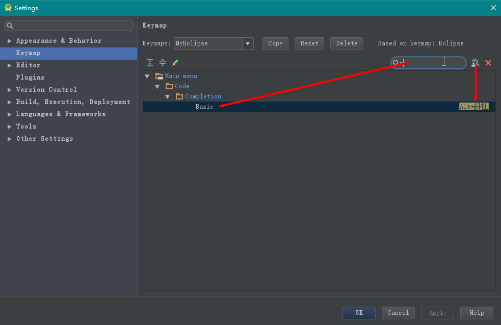

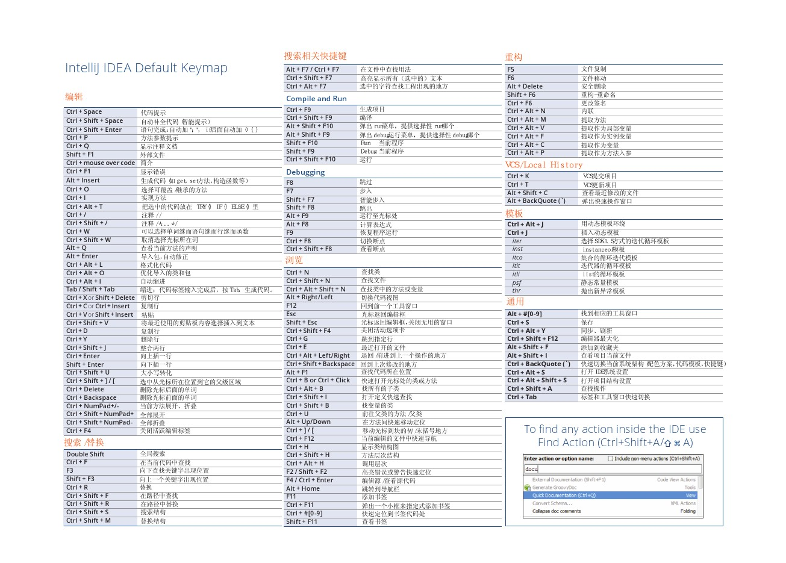

## Ctrl + Shift + T 查找类

## Ctrl + Shift + R 查找文件

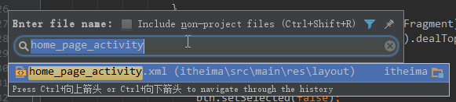

## Ctrl + O 

显示一个类的成员：成员变量，方法，输入方法名可以快速定位到方法位置

## F4 显示类的继承结构

## 查找功能

### 1. 在当前窗口查找文本【Ctrl+F】

F3 向下查找关键字出现位置 
Shift+F3 向上一个关键字出现位置

### 2. 在当前工程内查找文本【Ctrl+Shift+F】

先会弹出一个对话框，直接点击【find】，开始在整个工程内查找该字符串 
 
查找结果如下： 

### 3. 查找类【Ctrl+N】

### 4. 查找文件【Ctrl+Shift+N】

### 5. 查找项目中的方法或变量【Ctrl+Shift+Alt+N】

### 6. 查找类/方法/变量引用的地方

先定位光标

右键选择“Find Usages”（快捷键Alt+F7）

结果在find窗口中

ctrl+F7就是该方法在当前类中的被使用到的地方

### 7. ctrl + o 查看所有可以重写的方法。

### 8. 在类中快速定位某个方法或属性Ctrl+F12

全局搜索

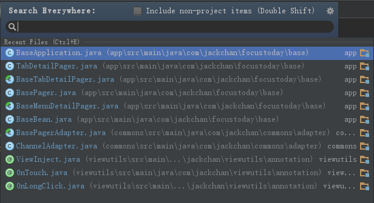

搜索指令 ctrl + shift + A

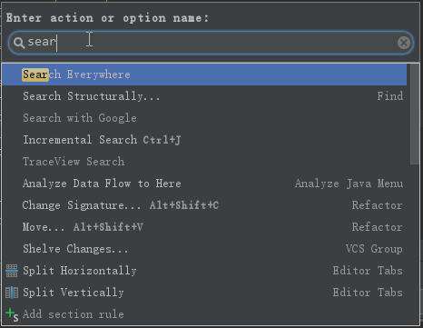

查找调用 Ctrl + G

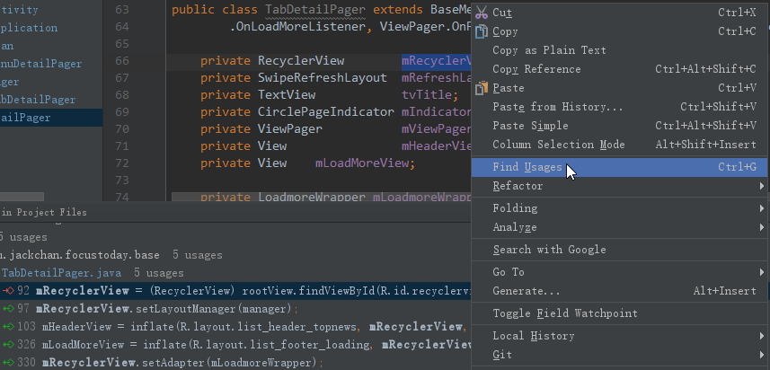

## 断点调试

### 条件断点

断点，右键

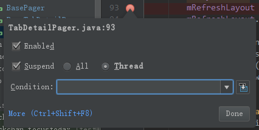

### 临时断点

Ctrl + Alt + shift + f8

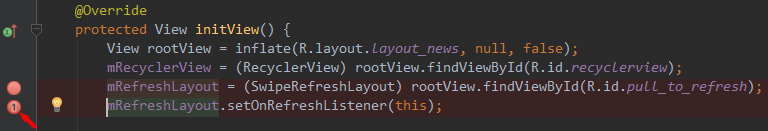

### 异常断点

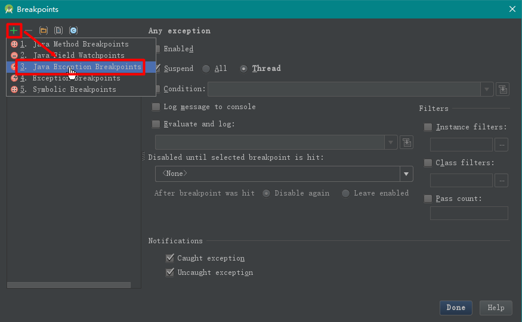

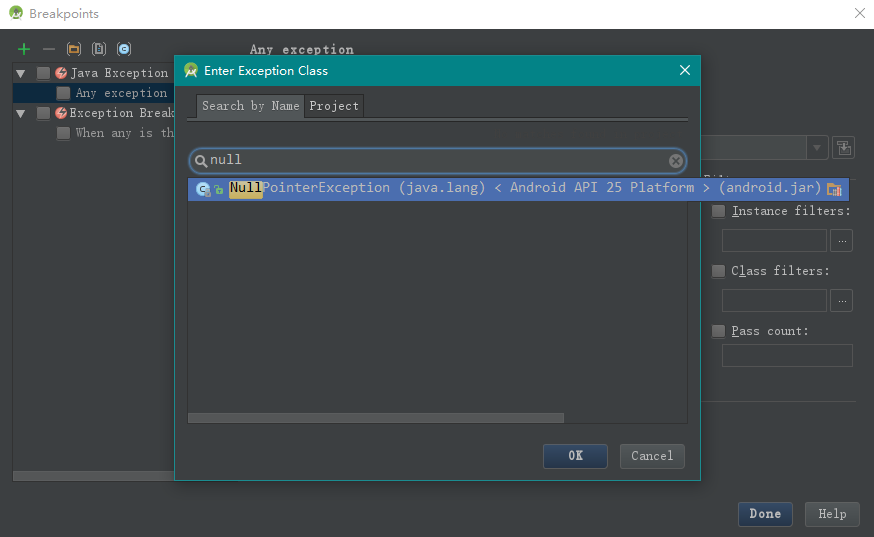

### 日志断点

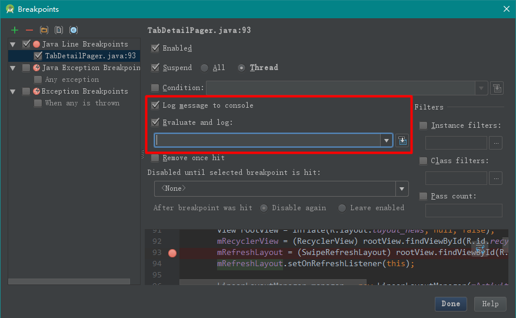

## 附加调试

正常启动程序，点击附加调试按钮，随时进入调试模式

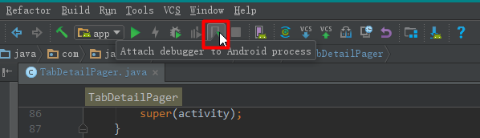

## 代码提示

Alt + /，智能提示 Alt + shift + 空格

## Surround With

Ctrl + Alt + T

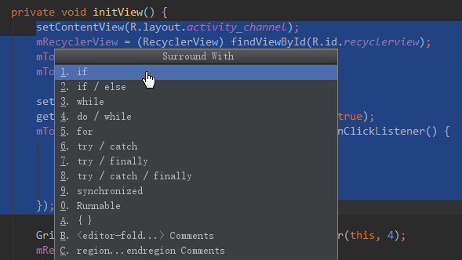

## 重构代码

把重复代码抽取成一个方法

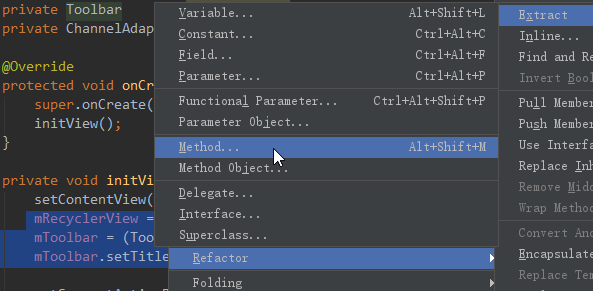

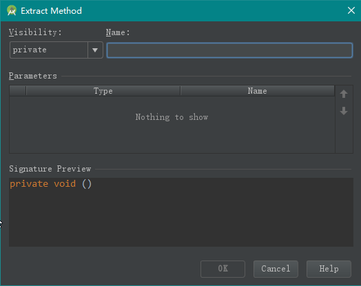

抽取xml属性

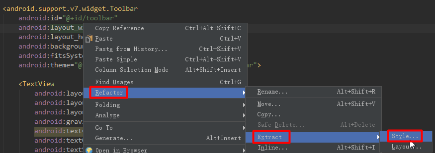

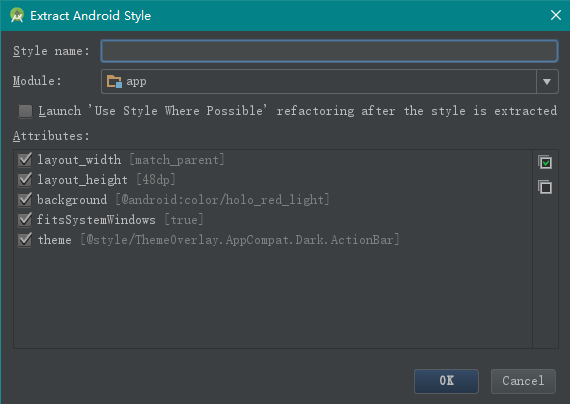

抽取layout

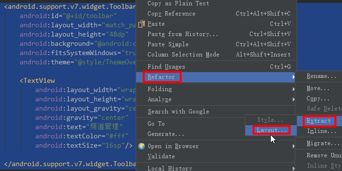

## template

后缀模板

## 项目模板

## theme editor

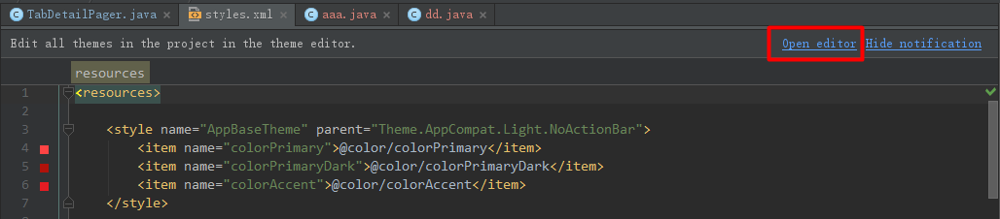

## 分析代码

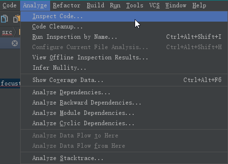

## 方法调用栈

Ctrl + Alt + H

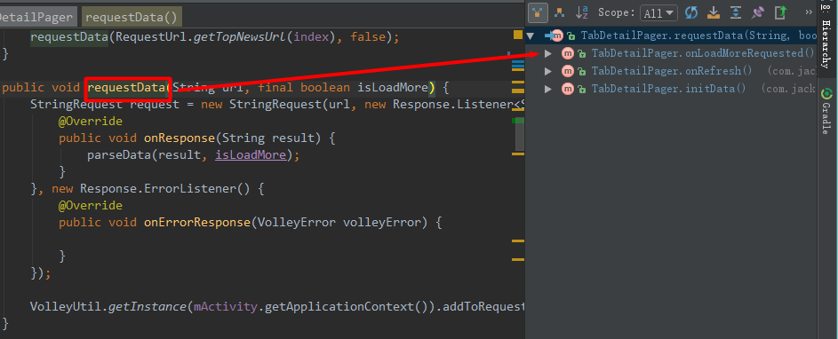

## 版本控制

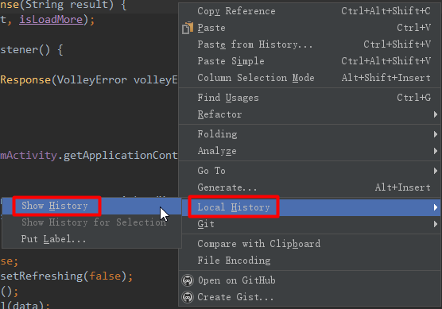

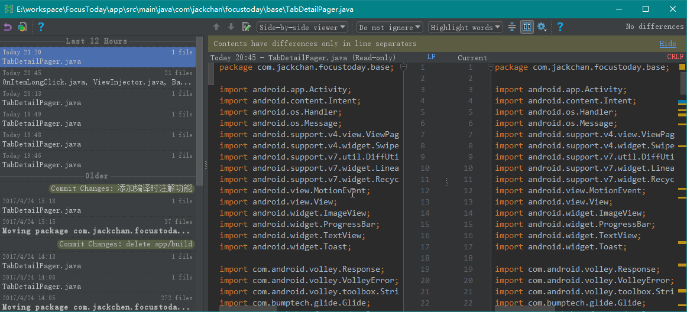

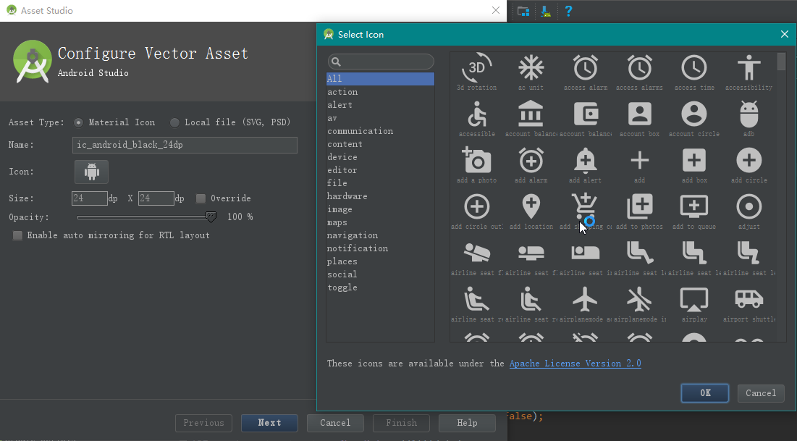

## Instant Run

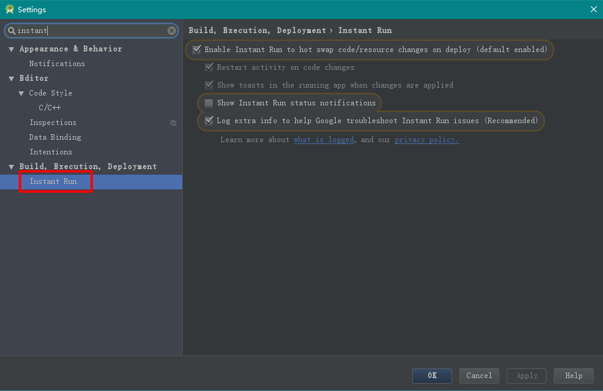

## gradle

### aar

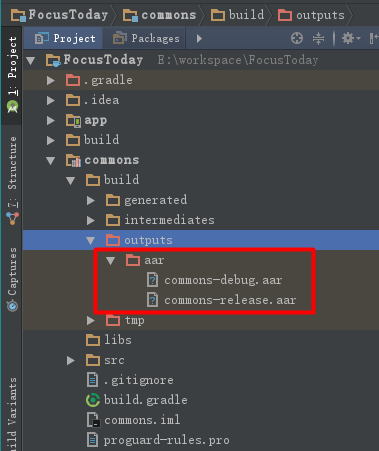

## 找打开的页面是哪个Activity

当跳转到一个Activity的时候，logcat会打印一条日志，显示开启的Activity

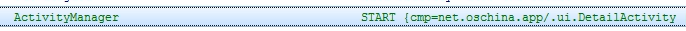

## 代码回退

代码未commit

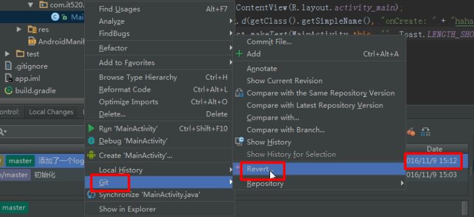

代码已commit

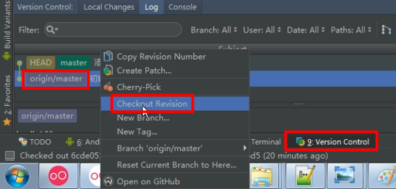

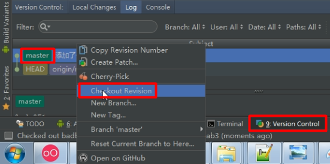

## 合并分支

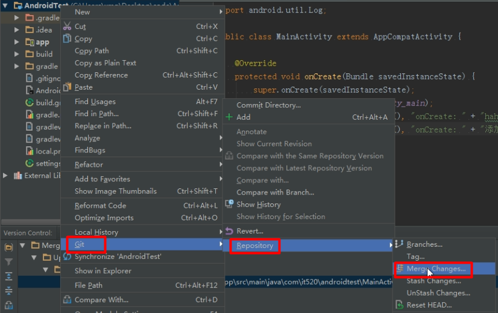

