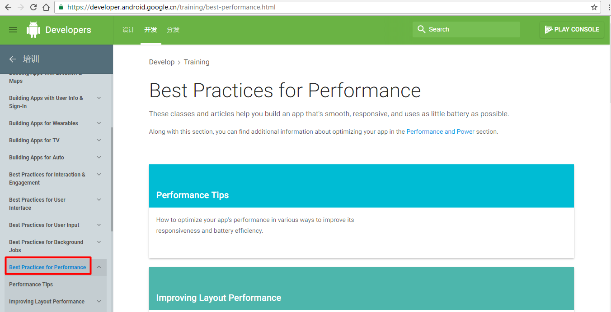
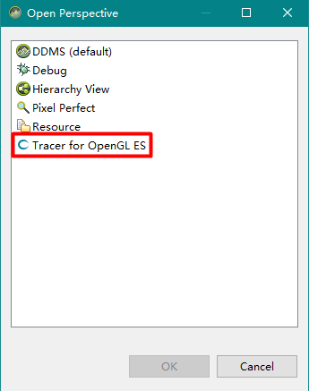
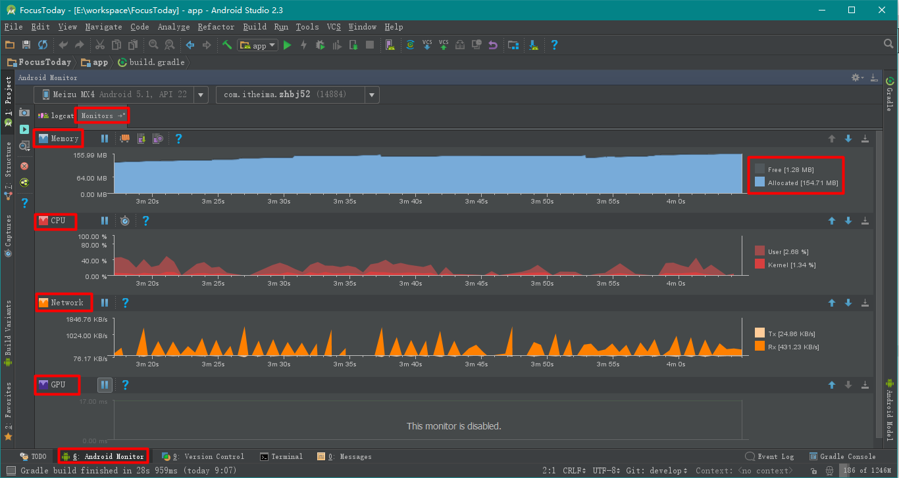

## [Best Practices for Performance](https://developer.android.google.cn/training/best-performance.html)

官方性能优化教程



## 性能优化工具

## 性能优化视频

## UI性能分析

### 16ms黄金准则

### BlockCanary

https://github.com/markzhai/AndroidPerformanceMonitor

[BlockCanary — 轻松找出Android App界面卡顿元凶](http://blog.zhaiyifan.cn/2016/01/16/BlockCanaryTransparentPerformanceMonitor/?utm_source=tuicool&utm_medium=referral)

BlockCanary是一个Android平台的一个非侵入式的性能监控组件，应用只需要实现一个抽象类，提供一些该组件需要的上下文环境，就可以在平时使用应用的时候检测主线程上的各种卡慢问题，并通过组件提供的各种信息分析出原因并进行修复。

取名为BlockCanary则是为了向LeakCanary致敬，顺便本库的UI部分是从LeakCanary改来的，之后可能会做一些调整。

[Android Monitor Overview](https://developer.android.google.cn/studio/profile/android-monitor.html)

[Optimize Memory Use with the Memory Monitor](https://developer.android.google.cn/studio/profile/am-memory.html)

## [Profile Your Layout with Hierarchy Viewer](https://developer.android.google.cn/studio/profile/hierarchy-viewer.html)






## [Android Device Monitor and DDMS Overview](https://developer.android.google.cn/studio/profile/monitor.html)

https://developer.android.google.cn/studio/profile/systrace.html

```java
public void ProcessPeople() {
    Trace.beginSection("ProcessPeople");
    try {
        Trace.beginSection("Processing Jane");
        try {
            // code for Jane task...
        } finally {
            Trace.endSection(); // ends "Processing Jane"
        }

        Trace.beginSection("Processing John");
        try {
            // code for John task...
        } finally {
            Trace.endSection(); // ends "Processing John"
        }
    } finally {
        Trace.endSection(); // ends "ProcessPeople"
    }
}
```

```java
Debug.startMethodTracing();
// code
Debug.stopMethodTracing();
```

## 内存探究

### 内存区分

- 寄存器
- 堆Heap
- 栈Stack
- 静态域
- 常量池

## 内存泄露

### leakcanary

https://github.com/square/leakcanary

## 电量分析

### battery-historian

https://github.com/google/battery-historian

## 高通性能工具

### trepn profiler

https://developer.qualcomm.com/software/trepn-power-profiler

###  App Tune-up Kit

https://developer.qualcomm.com/software/app-tune-up-kit