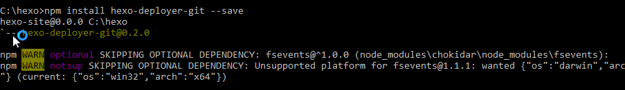

## 安装

- [Node.js](http://nodejs.org/)
- [Git](http://git-scm.com/)
- Hexo


```
$ hexo init <folder>
$ cd <folder>
$ npm install
```





## 主题

[有哪些好看的 Hexo 主题？](https://www.zhihu.com/question/24422335)

https://github.com/iissnan/hexo-theme-next

http://theme-next.iissnan.com/

http://notes.iissnan.com/

## bug

1、主页显示3秒后跳转至http://www.itcast.cn，原因如下

在《Http协议》博客中，包含了下面的html标签，把<改为`&lt;`

> 在HTMl页面中可以使用&lt;meta http-equiv="Content-Type" content="text/html; charset=UTF-8">来指定响应头，例如在index.html页面中给出&lt;meta http-equiv="Refresh" content="3;url=http://www.itcast.cn">，表示浏览器只会显示index.html页面3秒，然后自动跳转到http://www.itcast.cn。


2、`fatal: could not read Username for 'https://github.com': No error`

- 以管理员身份运行命令行
- 把cmd换成git bash
- 把仓库`https://github.com/JackChan1999/JackChan1999.github.io.git`换成`git@github.com:yourname/yourname.github.io.git`

## Read More

<!--more-->

在<!--more-->之前的内容会显示在首页，之后的内容会被隐藏，当游客点击Read more才能看到。

http://www.ituring.com.cn/article/tagged/33826

## 图床

七牛云存储，10G免费空间，CDN的全称是Content Delivery Network，即内容分发网络