## 安装前提

安装 Hexo 相当简单。然而在安装前，您必须检查电脑中是否已安装下列应用程序：

- [Node.js](http://nodejs.org/)
- [Git](http://git-scm.com/)
- Hexo

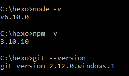

 

```bash
# 使用 npm 安装 Hexo
npm install -g hexo-cli
```

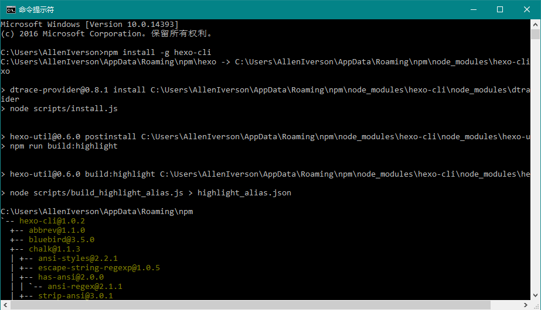

```
$ hexo init <folder>
$ cd <folder>
$ npm install
```

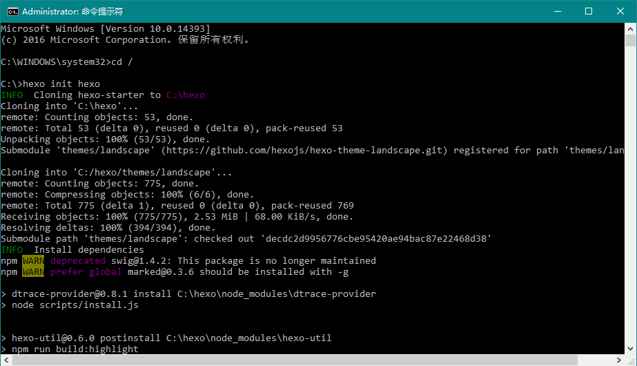

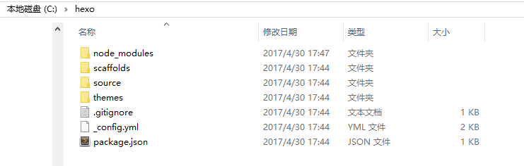

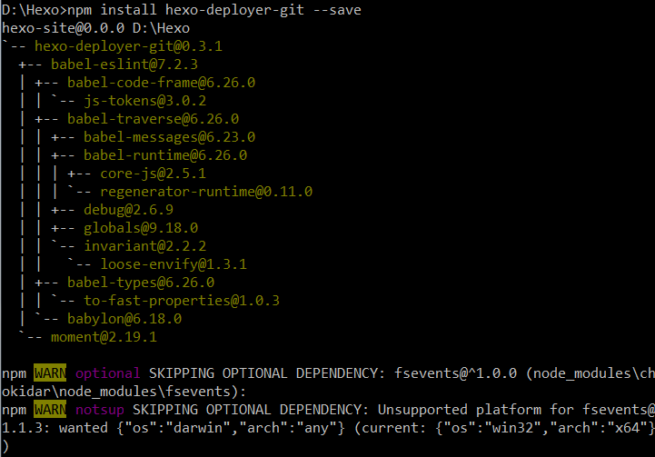

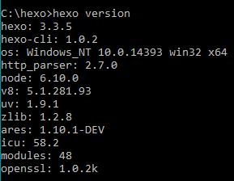

```
# 生成静态页面,hexo g
hexo generate
#启动本地服务，进行文章预览调试
hexo server
hexo deploy
# 部署
npm install hexo-deployer-git --save
```

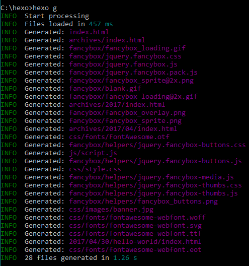

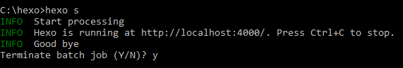

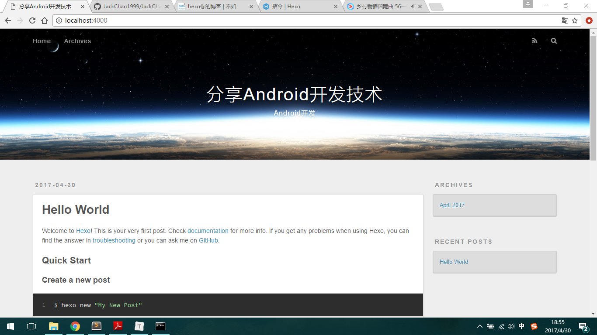


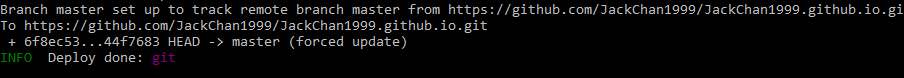

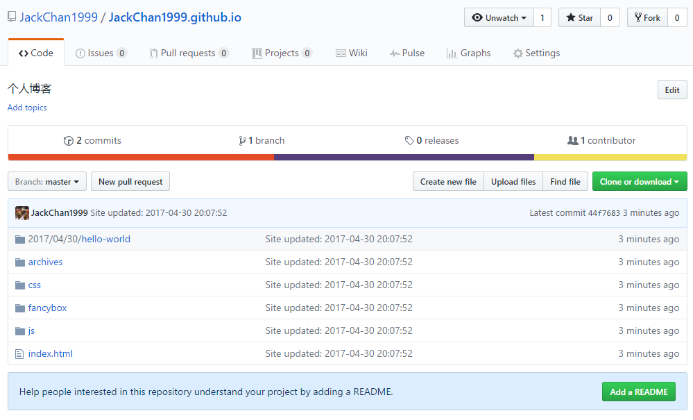

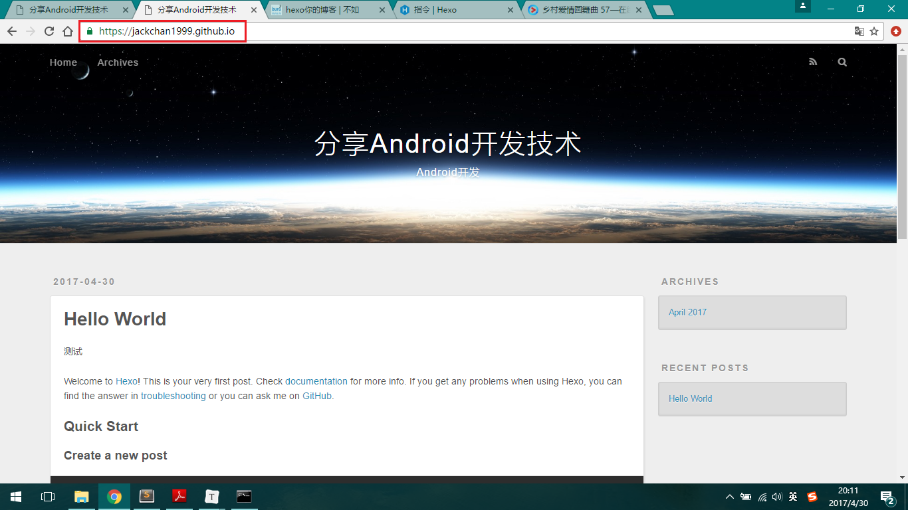

## 配置

### 站点配置文件

_config.yml


### 主题配置文件

themes

## 主题

[有哪些好看的 Hexo 主题？](https://www.zhihu.com/question/24422335)

- [hexo-theme-next](https://github.com/iissnan/hexo-theme-next)
- [在线预览 Preview](http://notes.iissnan.com/)
- [Next 使用文档](http://theme-next.iissnan.com/)

## bug

1、主页显示3秒后跳转至http://www.itcast.cn，原因如下

在《Http协议》博客中，包含了下面的html标签，把<改为`&lt;`

> 在HTMl页面中可以使用&lt;meta http-equiv="Content-Type" content="text/html; charset=UTF-8">来指定响应头，例如在index.html页面中给出&lt;meta http-equiv="Refresh" content="3;url=http://www.itcast.cn">，表示浏览器只会显示index.html页面3秒，然后自动跳转到http://www.itcast.cn。

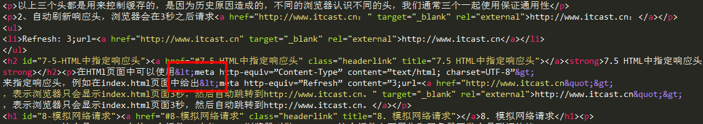

2、`fatal: could not read Username for 'https://github.com': No error`

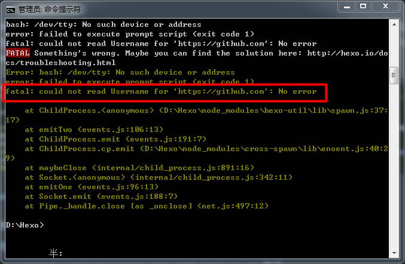

- 以管理员身份运行命令行
- 把cmd换成git bash
- 把仓库`https://github.com/JackChan1999/JackChan1999.github.io.git`换成`git@github.com:yourname/yourname.github.io.git`

3、ERROR: Permission to ItVedios/ItVedios.github.io.git denied to JackChan1999.

在.ssh下有原来账号的公钥私钥，新账号需要重新生成自己的公钥私钥，在重新生成的时候，如果.ssh下存在有公钥私钥的话，会重命名，需要将重命名的名字改为id_rsa，否则不能识别。

## Read More

<!--more-->

在<!--more-->之前的内容会显示在首页，之后的内容会被隐藏，当游客点击Read more才能看到。

http://www.ituring.com.cn/article/tagged/33826

## 图床

七牛云存储，10G免费空间，CDN的全称是Content Delivery Network，即内容分发网络