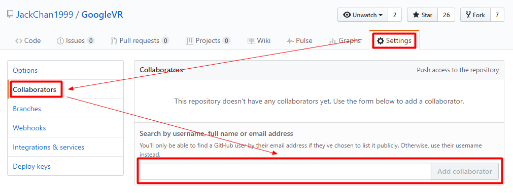
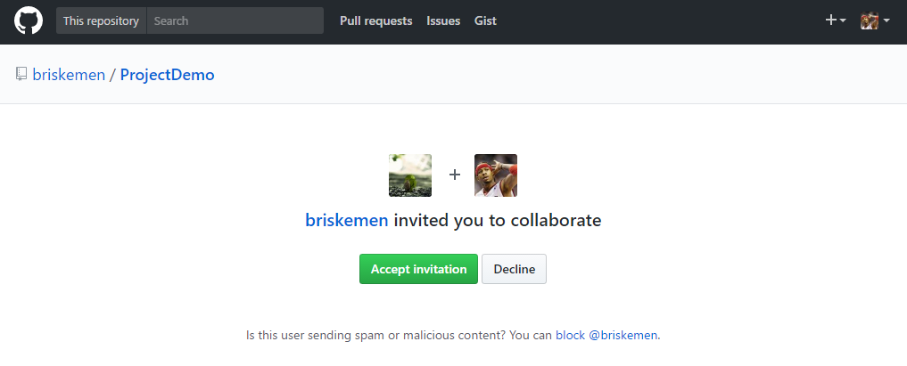

## 添加合作者






## 使用ssh方式提交


```bash
# 使用 https 方式提交每次都要输入账号密码
# https://github.com/JackChan1999/Java_Basic_Introduction.git
# 使用 ssh 方式提交
$ git remote rm origin
$ git remote add origin git@github.com:JackChan1999/Java_Basic_Introduction.git
$ git push origin
```
