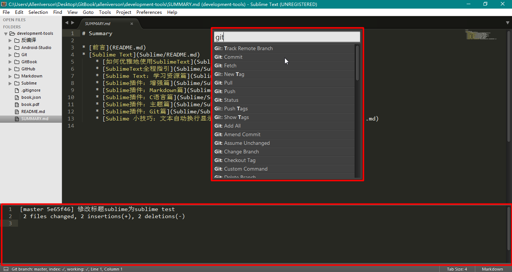
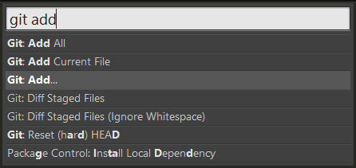
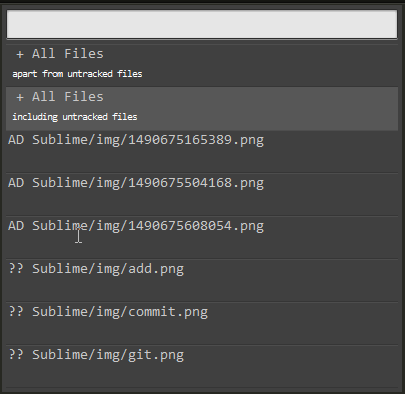
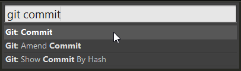
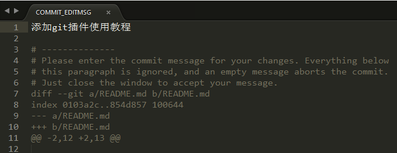
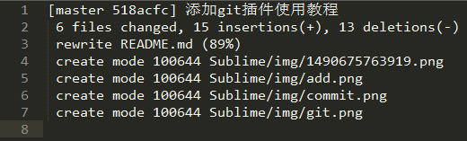
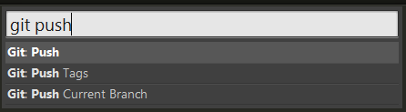
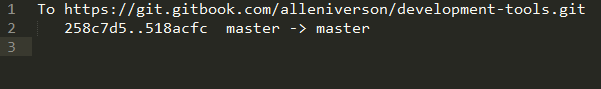

如何安装插件详见：[https://packagecontrol.io/installation](https://packagecontrol.io/installation)
关于Git的一些相关资源：[http://www.jianshu.com/p/25647b9920b7](http://www.jianshu.com/p/25647b9920b7)

## [SublimeGit](https://sublimegit.net/)：Git党必备

在安装后，如果在使用`ctrl+shift+p`输入一些个Git命令之后，弹出如下的错误提示，那么可能是因为Git可执行命令没有加入到环境变量中。

提示Git命令不在PATH中错误

**解决办法**：将Git的bin文件夹目录添加到系统环境变量，然后重启Sublime即可，嗯，一定要重启Sublime才可以使用。

此时，可以使用`git status`，`git log`等常用命令，但是一旦使用`git pull`来与远程服务器同步，此时就发现Sublime下面的状态栏就会一直来回摆动，无法与远程同步，原因为仅仅将Git命令加入Path是不够的，需要安装[msysgit](https://msysgit.github.io/)时选择将其集成到Windows中，如下图所示：

将Git集成到Windows命令行选项中

好吧，此时才将Git命令集成到Sublime中。输入`ctrl+shift+p`，输入`git`显示可以调用的相关命令如下图所示。

集成到Sublime中的Git命令

##  [GitSavvy](https://github.com/divmain/GitSavvy)

SublimeGit的同类竞品

## [GitGutter-Edge](https://github.com/jisaacks/GitGutter)

实时显示当前工作区的文件与以下四种的区别Compare against HEAD(默认选项)Compare against particular branchCompare against particular tagCompare against specific commit

如果选择默认的第一个选项，就可以实时看到当前的工作区（workplace）相对于最近一次提交（HEAD）的修改。

## [Gitignore](https://github.com/kevinxucs/Sublime-Gitignore)

一键生成[the collection of gitignore boilerplates by Github](https://github.com/github/gitignore)，多种文件类型任你选，以下用Gitignore新建C语言的忽略文件模板。

用Gitignore新建`.gitignore`模板文件

##  [Git Config](https://github.com/robballou/gitconfig-sublimetext)

设置`.gitignore`和`.gitconfig`等文件语法高亮。

安装完后可设置为Git Ignore或者Git Config高亮显示

## [SideBarGit](https://github.com/titoBouzout/SideBarGit)

在侧边栏的右键上增加Git常用操作，鼠标党喜欢的方式

左右资源栏出现`Git`一项可以调用常用Git命令

##  [Github Tools](https://github.com/temochka/sublime-text-2-github-tools) / [Sublime GitHub](https://github.com/bgreenlee/sublime-github)

与GitHub网站紧密联系，可以直接在Sublime中打开与GitHub关联的网址

## [GitHub Sublime Theme](https://github.com/AlexanderEkdahl/github-sublime-theme)

一款GitHub主题，好像和Git没啥关系，--|，乱入的
## [Git Conflict Resolver](https://github.com/Zeeker/sublime-GitConflictResolver)

用以解决在Merge过程中产生的冲突用

## [Sublime Merger](http://www.sublimerge.com/)

各种比较，套用官方的话和图如下Sublimerge brings the missing side-by-side diff to Sublime Text and turns your favorite editor into the professional diff and merge tool with amazing features!

## [Sublime Gerrit](https://github.com/borysf/SublimeGerrit)

使用在Git之上搭建起来的Gerrit Code Review的命令与原生有点不同，因为Gerrit默认是推送到中间用于Review的缓冲区的，只有Reivew通过之后才会并入真正的代码版本库。其命令使用如下：

## Sublime Text 系列

- [Sublime Text：学习资源篇](http://www.jianshu.com/p/d1b9a64e2e37)
- [Sublime插件：增强篇](http://www.jianshu.com/p/5905f927d01b)
- [Sublime插件：Markdown篇](http://www.jianshu.com/p/aa30cc25c91b)
- [Sublime插件：C语言篇](http://www.jianshu.com/p/595975a2a5f3)
- [Sublime插件：主题篇](http://www.jianshu.com/p/13fedee165f1)
- [Sublime插件：Git篇](http://www.jianshu.com/p/3a8555c273d8)
- [Sublime 小技巧：文本自动换行显示？](http://www.jianshu.com/p/c75d21d2e967)

## Git插件使用

快捷键ctrl+shift+p打开命令版，在输入框输入git即可显示git命令提示，底部是console控制台，输出执行git命令后的信息

### git add

### git commit 提交

commit message

### git push

