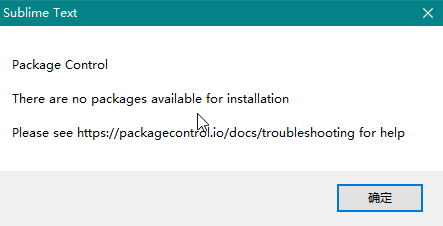

## 侧边栏

view → side bar → show side bar（显示）

## package control 

There are no packages available for installation



```
Package Control: Attempting to use Urllib downloader due to WinINet error: Error downloading channel. (errno 12152) during HTTP write phase of downloading https://packagecontrol.io/channel_v3.json.
Package Control: Error downloading channel. URL error [WinError 10060] 由于连接方在一段时间后没有正确答复或连接的主机没有反应，连接尝试失败。 downloading https://packagecontrol.io/channel_v3.json.
```

解决方法：http://www.jianshu.com/p/a3af44257b15

## 如何优雅的使用Sublime Text

http://jeffjade.com/2015/12/15/2015-04-17-toss-sublime-text/

