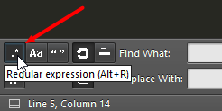
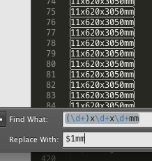
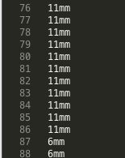
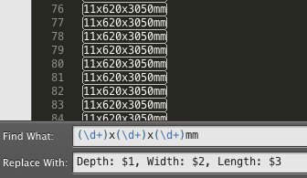
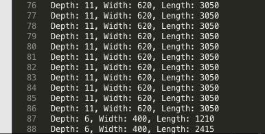

## 使用正则表达式查找替换

> 原文地址：

http://frontmag.no/artikler/utvikling/regex-search-and-replace-sublime-text-2

```
10x620x580mm
10x620x580mm
11x620x2390mm
11x620x2390mm
11x620x3050mm
```

取得每行的第一个数字，然后加上mm，比如第一行，要变成10mm

快捷键

- Ctrl+ F 查找
- Ctrl + H 查找替换
- Ctrl + Shift + F 多文件搜索&替换



这个图标就表示开启了正则匹配


你可以立即看到你匹配的模式，其实这是开启了highlight matches的功能，就是第一个图的最后一个图标



我们要取得每行的第一个数字，并要在它后面加上mm，其余的全删掉，那么第一组匹配的可以用$1选择，第二组用$2如此，那我们就把他们替换成$1mm



然后就这样低调的搞定了。还想做点别的，比如加点描述，想让别人知道每个数字代表什么



于是替换模式变成这样



## 利用正则表达式修改内容


目标：在这些大写缩写（用`([A-Z]+:)`正则表达式选出）前加一个换行符, 实现每个缩写都独立在一行。 
实现方法：使用 Sublime Text的替换功能。在 Replace With 一栏填入`\n$1`， 点击 Replace All按钮就可以了。`$1`表示上面那个正则表达式第一个括号内的内容。效果如下


