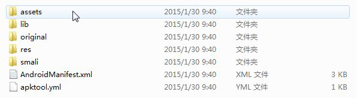
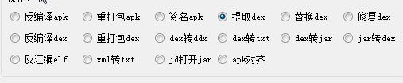
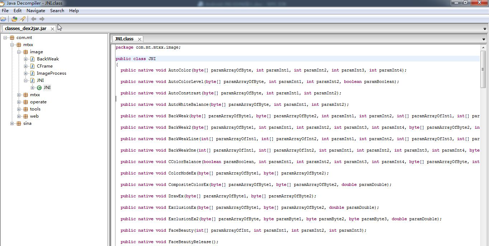
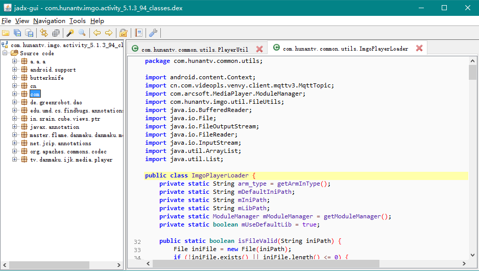

# 1. 安卓逆向助手

有一款叫安卓逆向助手软件反编译apk 十分方便。这里给大家介绍的反编译方法就是基于这款软件的。[安卓逆向助手下载地址](http://pan.baidu.com/s/1eQkvlvW)

Android逆向助手是一功能强大的逆向辅助软件。该软件可以帮助用户来进行apk反编译打包签名；dex/jar互转替换提取修复；so反编译；xml、txt加密；字符串编码等等，操作简单，只需要直接将文件拖放到源和目标文件。


将下载好的rar 包解压缩以后目录结构如下（内置的广告被我删除后的）

Tips：lib 目录存放都是用java 写的核心反编译逻辑，必须跟exe 文件放在同一个目录下。

打开Android 逆向助手.exe，如下图所示：


选择源文件，并且选择（也是默认的选择）反编译apk，我们找到mtxx.apk 的路径，然后点击操作。
在mtxx.apk 目录下生成了一个mtxx 文件夹，打开该文件，目录结构如下图所示：



在上面操作后打开lib 目录可以找到美图秀秀的动态库文件，但是我们还需要找到其java 代码。显然
美图秀秀用smali 算法反编译了。那么我们接着下一步。


在Android 逆向助手.exe 中打开源文件，选择提取dex 点击执行。



这时候在目标文件夹下生成了dex 文件


最后在Android 逆向助手.exe 中选择dex 转jar 选项。在源文件中选择上一步生成的classes.dex 文件，然后点击执行（这个过程大概需要几秒的等待时间）。这时候该软件会自动将我们生成的jar 文件用jd-gui工具打开。打开效果如下所示：



# 2.  jadx

jadx是新一代反编译大杀器，[github地址](https://github.com/skylot/jadx)。Android开发(/学习)有时候需要用到反编译工具，Window上有很多工具，而Mac上则不多，这里稍微介绍一下Mac上可用的反编译工具Jadx

准备：clone 仓库，编译

```
mkdir jadx
git clone https://github.com/skylot/jadx.git
cd jadx
./gradlew dist #这个需要稍微等待一下
```

开始反编译，等完毕后，可以开始了，我就介绍个最简单最常用的用法

把apk改成zip，解压zip获取class.dex文件，将class.dex文件放到jadx目录下

```
cd build/jadx/
bin/jadx -d out class.dex  # 反编译后放入out文件夹下(如果out不存在它会自动创建)
#or
bin/jadx-gui class.dex  # 会反编译，并且使用gui打开
```



OK，就这样，后续还可以配置环境变量，更加方便

# 3. 更多反编译工具

## [3.1 Classyshark](https://github.com/google/android-classyshark)
  轻松查看apk内部每个包的方法数，用了哪些开源库，同样拿知乎开刀做例子
  

## [3.2 smalidea](https://github.com/JesusFreke/smali/wiki/smalidea)
  smali代码调试插件，你以为没有拿到安卓Java源码就不能调试了吗？图样图森破了吧
  

## [3.3 IDA Pro](https://www.hex-rays.com/products/ida/)
  IDA Pro，逆向大利器，不管你是smali还是so文件，照样动态调试你

## 3.4 Android Killer 
[下载地址1](http://www.pd521.com/thread-136-1-1.html) [下载地址2](https://pan.baidu.com/share/home?uk=4099707276#category/type=6) [使用指南](http://www.pd521.com/thread-509-1-1.html)
集Apk反编译、Apk打包、Apk签名，编码互转， ADB通信（应用安装-卸载-运行-设备文件管理）等特色功能于一 身，支持logcat日志输出，语法高亮， 基于关键字（支持单行代码或多行代码段）项目内搜索， 可自定义外部工具；吸收融汇多种工具功能与特点， 打造一站 式逆向工具操作体验，大大简化了用户在 安卓应用/游戏修改过程中的各类繁琐工作。

## 3.5 SmaliViewer 
[下载地址](http://blog.avlyun.com/wp-content/uploads/2014/04/SmaliViewer.zip) [使用指南](http://blog.avlyun.com/show/%E3%80%8Asv%E7%94%A8%E6%88%B7%E6%8C%87%E5%8D%97%E3%80%8B/)
是一款免费的APK分析软件，无论从分析的深度还是广度来看，都是一款能够满足用户需求的产品，使您在APK分析的过程中，更加得心应手。

## 3.6 Enjarify
Enjarify 是一个用 Python 写的， Google 官方开源的可以将 Dalvik 字节码转换为 Java 字节码的工具

## 3.7 ApkTool

http://www.softpedia.com/get/Programming/Debuggers-Decompilers-Dissasemblers/ApkTool.shtml

## 3.8 Dextojar

